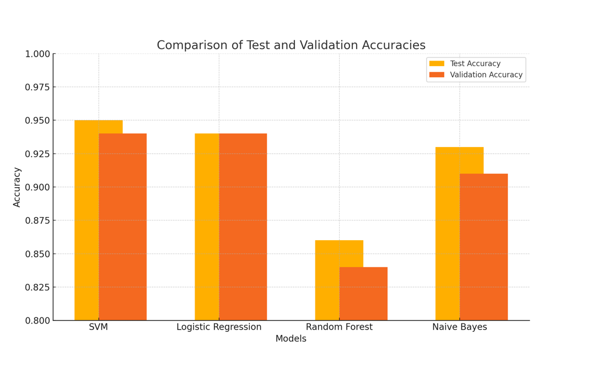

# NPL-project
Real or Fake news? No worries — our Natural Language Processing (NLP) model will decide for you!
We developed a robust text classification model capable of distinguishing between real and fake news articles, leveraging advanced NLP techniques

[Task Descriptions and Project Instructions](https://github.com/ironhack-labs/project-nlp-challenge)


# About the Project
This project focuses on building a machine learning pipeline for fake news detection. Using NLP methods and classification algorithms, we trained and evaluated a model that can analyze news articles and predict their authenticity with high accuracy.

# Features
- Text preprocessing: tokenization, stopwords removal, stemming, lemmatazing, vectorization.
- Model training: leveraging algorithms such as super vector machine, Logistic Regression, Naive Bayes, Random Forest.
- Experimentation with embedding-based and TF-IDF-based models ((using Word2Vec and GloVe)
- Evaluation metrics: accuracy, precision, recall, F1-score, R2.


# Dataset
We have been provided two datasets: 
- Labeled dataset (training_data_lowercase.csv) with real and fake news headlines for training and evaluation.
- Unlabeled dataset (testing_data_lowercase_nolabels.csv) for generating predictions and testing the model in real-world scenarios.

# Repository Folders and Files
- SVM (winner model) notebook and predictions.
- Multinomial Naive Bayes notebook and predictions
- Random Forest Classifier notebook and predictions
- Logistical regression notebook and predictions.
- GloVe embeddings notebook and predictions.
- Word2Vec embeddings notebook and predictions.
- Images of the readme.
- Presentation of the project.
- Labeled data set (training_data_lowercase.csv)
- Unlabeled data set (testing_data_lowercase_nolabels.csv)

# Installation
Use requirements.txt to install the required packages to run the notebooks. It is advised to use a virtual environment.
```bash
python -m venv .venv
.venv/Scripts/activate
pip install -r requirements.txt
```
